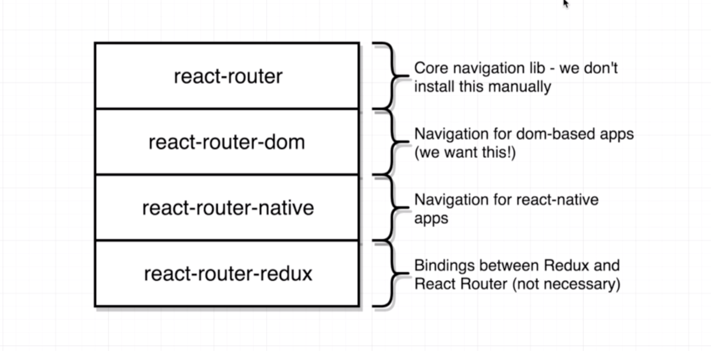
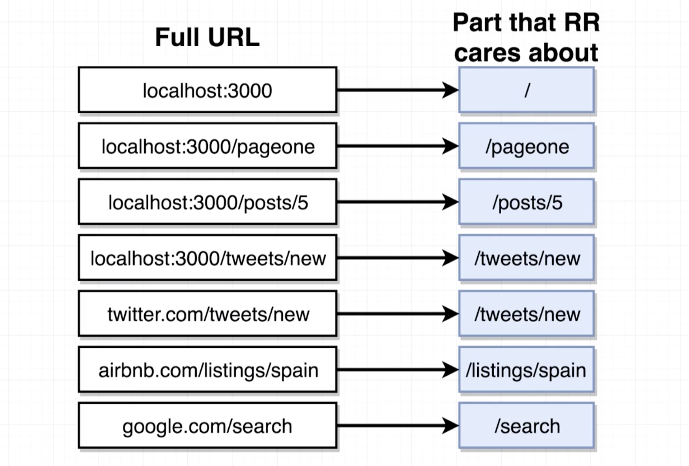
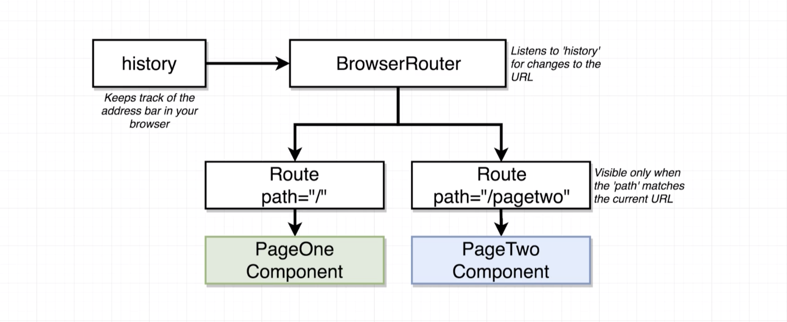

# 20200809 Navigation with React Router

```js
npm install --save react-router-dom
```

To get started with navigation, we're going to install a dependency called react router.



inside of the react router family of libraries, there's a couple of different dependencies that you could possibly install. now you will very commonly make a typo accidentally install the react router library, but it turns out we never actually want to install react router by itself.

The react router library as it is published on NPM is the core library of everything inside of the react router general project. So this library has some core navigation logic inside of it. It decides how to work with react how to change content out depending upon some different rules and some other low level logic.

To get an actual implementation of react router that works inside of specifically the browser, we install the package react router dom, and that's what we just installed. So anytime that you want to use react router on a project to handle navigation as we are about to do, you're always going to be installing this project called react router dom and you are not going to install react router.

There's another one called react router native. This is a routing library for use in sight of react native projects. In our case for what we're doing inside this course we're making web applications, so we make use of react router dom. We are not making native mobile apps. react router native is for native mobile applications. so it's not appropriate for anything that we are doing inside the browser.

Now finally there's one other package that is called react router redux. This is a library that is very similar to the reacts redux library that we've been using in our past few applications. It is essentially a compatibility layer to get react router and redux to play along with each other very nicely.

```js
const PageOne = () => {
  return <div>PageOne</div>;
};
const PageTwo = () => {
  return <div>PageTwo</div>;
};

const App = () => {
  return (
    <div>
      <BrowserRouter>
        <div>
          <Route path="/" exact component={PageOne} />
          <Route path="/pagetwo" component={PageTwo} />
        </div>
      </BrowserRouter>
    </div>
  );
};
```

browser router is an actual react component. so now I see Page 1 appear on the screen. Now very interestingly I'm going to change my address bar up here I'm going to go to localhost clone three thousand slash page two, now I see the text page two appear on the screen.

Now we noticed that when we navigated to different URLs inside of our browser, we saw different content appear on the screen, and it appeared to be depending upon the different route that we added in to this URL.



So when we visit localhost 3000 and we type that address into our Url, it loads up our application, but react router does not care about the entire Url. In other words, react router does not care that we went to a domain of local host or that we were at port 3000. Instead react router only cares about all the characters that are listed after the domain definition and the port definition. localhost 3000 is interpreted as being localhost 3000 slash, that is a totaly equivalent url to just localhost 3000.

So if we go to localhost 3000 slash pageone, react router only cares about everything after the port and the domain, so react router would only care about slash pageone when deciding what content to display on the screen.



when we created our application and loaded it up inside the browser, we created an instance of the browser router component. the browser router internally creates an object of its own called The history object. This history object is going to look at the url inside of your address bar and its going to extract just that portion of the url that react router cares about. just everything after the domain name or the port.

The history object is then going to communicate that path over to browser router, and then browser router is then going to communicate that path down to both of your route components. The route components are then going to decide either to show themselves or hide themselves depending upon the path inside of the url that the user is visiting and the path property that it was passed when it was created.

```js
const App = () => {
  return (
    <div>
      <BrowserRouter>
        <div>
          <Route path="/" exact component={PageOne} />
          <Route path="/pagetwo" component={PageTwo} />
        </div>
      </BrowserRouter>
    </div>
  );
};
```

So in other words, when we visit localhost 3000 slash, we have a path of forward slash by itself. And so as you might imagine, we have a route right here with a path of forward slash, the url and the path property right here match up. And so react router decides to show this route component on the screen.
