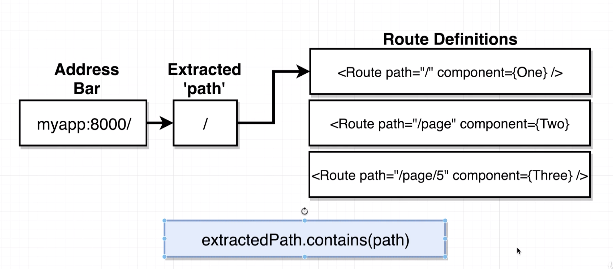
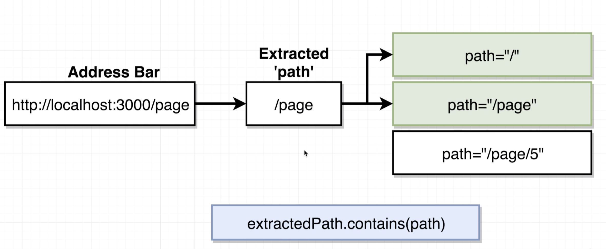
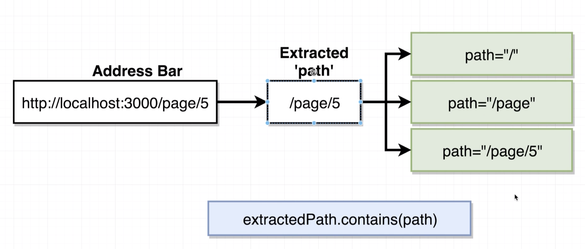

# 20200811 Navigation with React Router

```js
const App = () => {
  return (
    <div>
      <BrowserRouter>
        <div>
          <Route path="/" exact component={PageOne} />
          <Route path="/pagetwo" component={PageTwo} />
        </div>
      </BrowserRouter>
    </div>
  );
};
```

both route components got a path property. This property right here is what is used by react router to decide whether or not to show this given component on the screen. On the first route we then have the keyword exact. When we pass in the component, if this route right here is matched by the given url that the user is visiting, we're going to show either page one or page two.

In a react router application, different routes can be matched by the same url and all showed themselves to the user. And so by deeply nesting routes we can customize how some part of our app looks depending upon the url, and we don't have to pass down some deep configuration through redux or props or something like that to configure how a very deeply nested child component renders itself.

```js
const App = () => {
  return (
    <div>
      <BrowserRouter>
        <div>
          <Route path="/" component={PageOne} />
          <Route path="/pagetwo" component={PageTwo} />
        </div>
      </BrowserRouter>
    </div>
  );
};
```

A single url or a single path can be matched by different routes inside of application, we now tried taking off that exact keyword on first route, and we saw both routes appear on the screen when we went to slash page 2.



So now using this path right here, I want to figure out what different route definitions would be shown inside of application. In this case, we would only be showing the first route definition, the one with a path of just forward slash. The rule that we use for deciding what components or what routes are going to be shown on the screen is the contains method.

this is not the exact code that react router internally runs, but it kind of works like 90 percent of the time for figuring out what is going on.

So essentially we take the string of the extracted path from the url, and we can imagine that we'd run the contains method with the path inside of each of our different route components. That contains method is going to essentially check if this string(path) exists inside of this string(extractedPath).





So this right here is the rule that react router uses to decide whether or not to show a given route on the screen and it explains why we see both of these routes appear.

```js
<Route path="/" exact component={PageOne} />
<Route path="/" exact={true} component={PageOne} />
```

Now in order to override this behavior, we can find all of our given routes and we can optionally add on a prop of exact. when we type out a keyword inside of a JSX tag like so, it is equivalent to saying equals true. So anytime you list out just a property name the component that you added to interpret that as having a prop equal to true. So inside of the route component it would think that this.prop.exact would equal the value true.

```js
extractedPath === path;
```

When you add on a prop name of exact, it causes react router to change the rule that it uses for matching the path slightly. And it essentially changes it to: does extracted path equal the string path.

when we add on this exact keyword, it only modifies the route that you added to.
