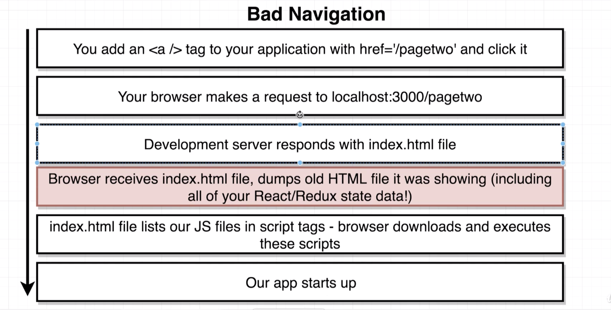
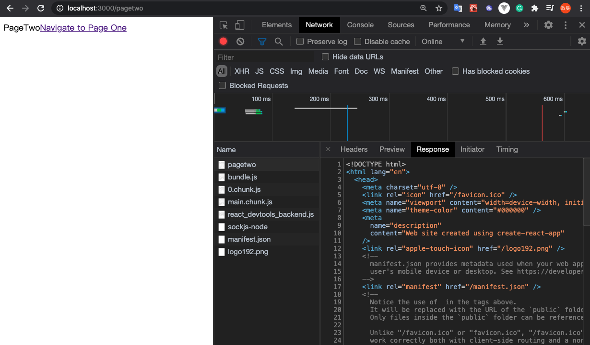
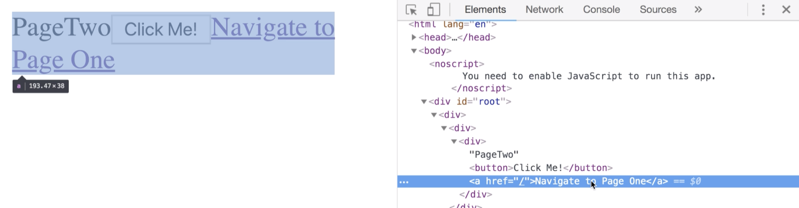
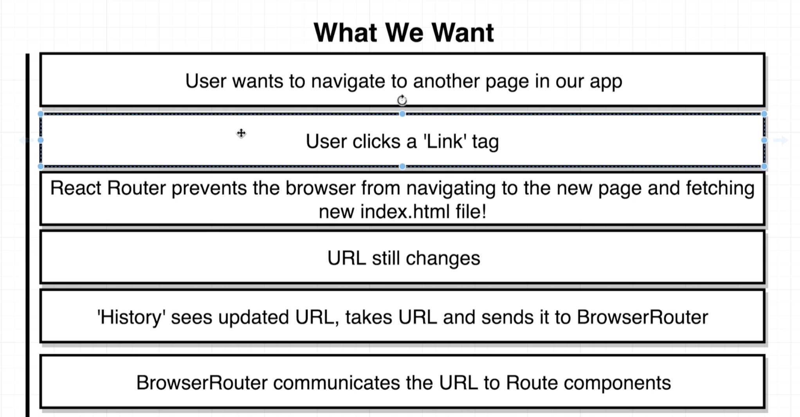
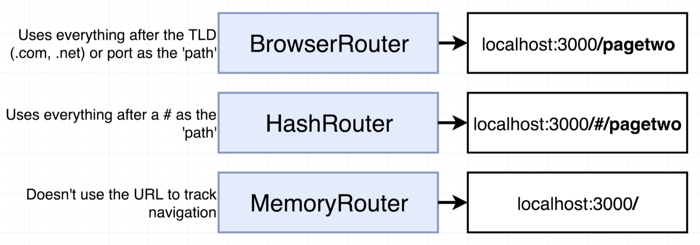
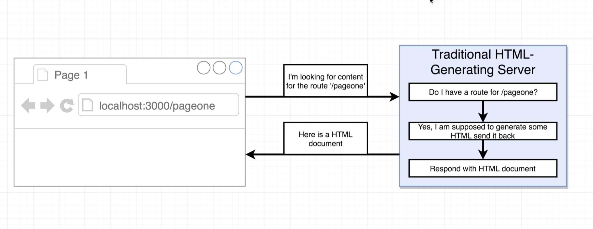
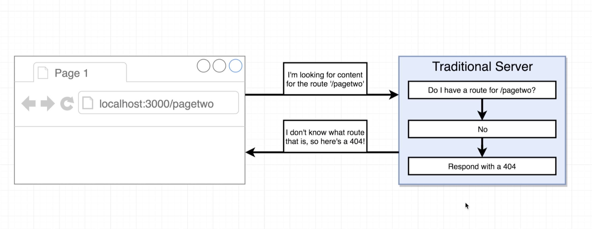
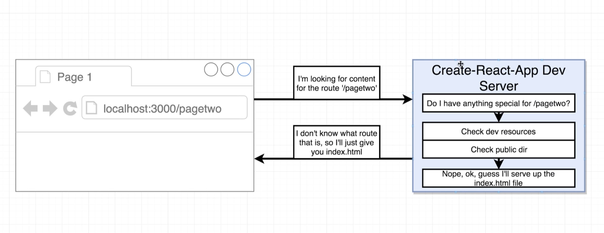

# 20200812 Navigation with React Router

```js
const PageOne = () => {
  return (
    <div>
      PageOne
      <a href="/pagetwo">Navigate to Page Two</a>
    </div>
  );
};
const PageTwo = () => {
  return (
    <div>
      PageTwo
      <a href="/">Navigate to Page One</a>
    </div>
  );
};
```

at present the only way that a user can navigate between the two routes that we have defined is by changing the address inside the address bar. Now if this was a traditional application using just straight HTML pages, doing this navigation would be very easy. we could put anchor tag inside of our two separate components. This is how we handle navigation in a traditional HTML app.



This is essentially the process that your browser goes through for every standard anchor tag out there on the Internet. So this is the normal operation of your browser.

When users click on anchor tag, what your browser does is make a request to localhost 3000 splash page two, that's going to make a request to our react development server. Anytime you make a request to our react development server, it's going to respond with our index.html file even if you attempt to navigate to slash page two. If we make a request to slash page two we're going to always get back our index.html file, the same one that is inside of our public directory.

Now when the browser receives that index.html file, it's going to take whatever current html document it showing on the screen and it's going to remove all that html from the screen. It's going to completely dump all that html. And in addition it's also going to dump all of the javascript code and all the javascript variables and data inside of your application as well. Now that is why we do not want to use anchor tags inside of the react router application. If you put anchor tags inside of your app and then you click on one, you're making a brand new request to some outside server that's going to return a brand new html document and then show it on the screen. during that process the normal operation of the browser is to dump all variables in memory all javascript data gets entirely dumped. So that means that in the context of your react and redux application any data that you had loaded up like any API requests or anything that user had typed in anything whatsoever is going to be 100 percent white and you entirely lose access to it. And so you would have to refetch all that data a second time, or have your user type all that data in which is obviously something that we probably don't want to happen inside of our app.

Now after the browser loads up the new index.html file, it's going to regrab our application execute the javascript code inside there, and our application is going to start up a second time but this time it's not going to have any of the data that it just had two seconds ago.

whenever I click on this anchor tag right here I make a request over to local host 3000 slash page two. if I click on that request I can then click on response tab in my console, and I'll see that I'm making an entire request to fetch the HTML document for my application. after I get this HTML document back, I then make some follow up requests inside my browser to get our javascript bundle that has all of our code with our react application inside of it. That entire process right there is duplicated when I then go back to page 1. So everytime I clicking on a link, I make a request for an entirely new HTML document and that dumps all the data I had loaded into my react and redux application.

---

```js
const PageOne = () => {
  return (
    <div>
      PageOne
      <Link to="/pagetwo">Navigate to Page Two</Link>
    </div>
  );
};
const PageTwo = () => {
  return (
    <div>
      PageTwo
      <Link to="/">Navigate to Page One</Link>
    </div>
  );
};
```



So this link thing right here is a react component that we're going to use in place of any anchor tags we ever want to show inside of our application. When we put down a link tag, we do not make use of the href prop. Instead we call it to. So this is essentially a link that when clicked is going to take the user to the route slash page two.



But when you click on that Link tag and inspect it, you'll notice that what actually showed up on the screen from the link component is an anchor tag anyways. So when you use the link tag you're still showing an anchor component or an anchor tag on the screen.




So anytime that we want a user to be able to navigate around our application, we're going to add in a link tag, and it's going to list the route that the user is going to navigate to when they click on it as the 'to' prop.

Whenever a user clicks on the anchor tag that internally gets rendered by that link because again it does show an anchor tag when it shows up on the screen, react router is going to automatically prevent the browser from navigating over to that new route in the traditional form. So it's going to keep the browser from trying to navigate to that new route, and refetching an html document.

Now the url is still going to change, the history object is going to see the updated url. So it's going to take that url and send it off to the browser router. the browser routers then going to communicate that url down to all the different route components and the route components are then going to re-render to show a new set of components depending upon the path that the user is now visiting.

When you make use of that link tag, we're still making use of a anchor elements on the screen. However, react router is going to detect a click on an anchor tag and override the default behavior and keep your browser from navigating away. So when you make use of the link tag, we are not dumping all of our react and Javascript data. We are just showing a different set of components on the screen.

this entire idea of not making an additional request for a separate html document when we click on a link is where the term single page app or spa comes from. single page app means that we are only loading up a single html document. We still allow the user to navigate around our application by clicking on various link tags. But when they navigate around, they still are making use of the same html document. We are just showing and hiding different sets of components based upon the URL. That's how we handle navigation inside react router application. We are essentially tricking the user into thinking that they really are going to different pages. But in fact, we're just showing and hiding different components.

---

The core of this discussion is around this browser router. Now in total react router actually has three different types of routers available. There is the browser router right here that we've made use of, and then there are two other routers as well. Each of these different routers, the only difference between them is the part of the url that they're going to look at when deciding what content to show on the screen.



the big difference between these is the part of the url that each router is going to use to track what content the user is trying to view.

with the browser router, react router is going to look for the top level domain or the TLD, that is the dot com or the dot net or the dot edu whatever it is and it's going to look for everything after that top level domain. Alternatively if you have a port definition, it's going to look for everything after the port definition.

with a hash router, react routers is going to automatically put a little hash character or a pound sign into your url, and then it's going to automatically trying to reflect the current path after that hash character.

with the memory router, the url is not used at all to track navigation.



This is a diagram of what happens when we make a request to localhost 3000 slash page one if localhost 3000 was a very traditional server like a very traditional Java or Ruby or Python server that always returned some html as opposed to a react application.

So we might type in an address like localhost 3000 slash page one, our browser would then make a request to our backend server, the backend server would then have some logic inside of it to look at the route that you were making a request for. So the server would then ask a question: do I have a route for Slash page one. And then inside of your server code there might be some route handler that says like: OK anytime someone makes a request to slash page 1, generate some html and send it back in the response. So the server would say: I've got some logic here, it says anytime someone makes requests to slash page one, I'm supposed to produce an html and send it back.

So the server does so, it generates some html, and then responds with that html document. And so a html document gets sent back to the browser and content shows up on the screen.



So let's imagine now that our server made a request to localhost 3000 slash page two. So browser makes the request, and then the traditional server says: Do I have a route for splash page two. But in this case no I don't have any route defined for splash page 2. It responds with a 404 error. a 404 error is a not found error. It means that our server had no defined route for slash page 2. And so the server said Sorry I don't know what to do with your request so I'm gonna return an error and tell you that you made a bad request and I don't know how to handle this. So again this is what happens with a traditional server.

with a traditional server, if you make a request to some route that is not defined, the server is going to respond with a 404 not found.


