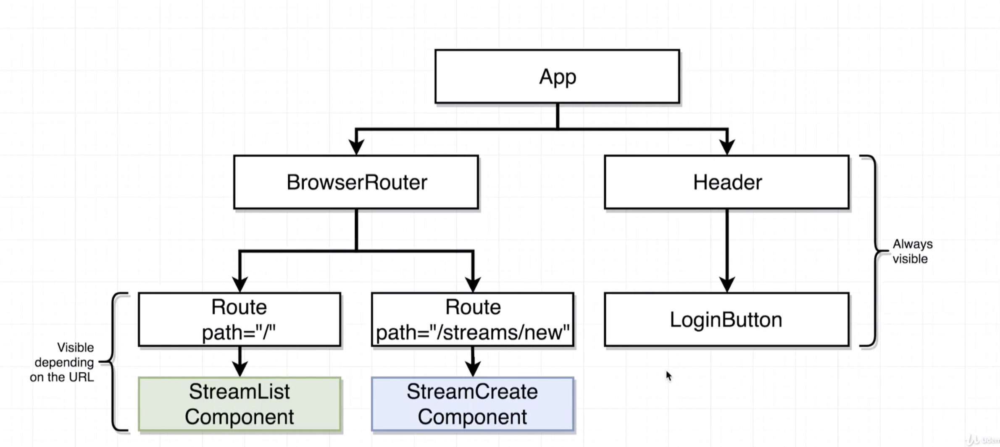
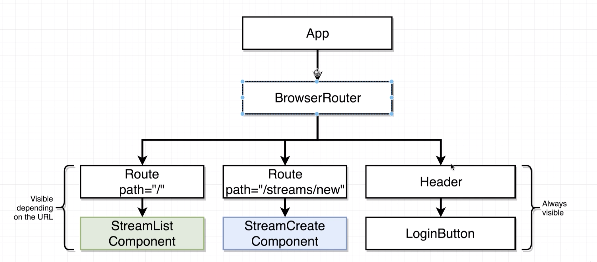

# 20200818 Navigation with React Router



we want our header component to always be visible no matter what url the user is trying to look at. in order to do so, we're going to add the header component to our app component outside of the browser router. If we have a component that is not listed inside the browser router, it will always be shown 100 percent of the time irrespective of what the current path is.

---

```js
const App = () => {
  return (
    <div className="ui container">
      <Header />
      <BrowserRouter>
        <div>
          <Route path="/" exact component={StreamList} />
          <Route path="/streams/new" exact component={StreamCreate} />
          <Route path="/streams/edit" exact component={StreamEdit} />
          <Route path="/streams/delete" exact component={StreamDelete} />
          <Route path="/streams/show" exact component={StreamShow} />
        </div>
      </BrowserRouter>
    </div>
  );
};
```

the error message says you should not use a link element outside of a router.

anytime that we wanted to make sure that a component was always visible inside of application, we could just place it outside the browser router. But one exception to that rule is if these outside components that should always be visible are going to contain any react router related elements, such as a link. If we are trying to show a link on a page or any element that is outside of our browser router. We're going to get the exact same error. This error message saying you should not use a link outside of a router, is essentially saying that any component that is not a child of our router(BrowserRouter) cannot contain any react router related components.



So we're going to make sure that the app component renders the browser router as it still is. But now we're going to simply take our header component and move it underneath the browser router.

Now because the header component is not going to be wrapped up inside of a route, the header will continue to always be visible.

```js
const App = () => {
  return (
    <div className="ui container">
      <BrowserRouter>
        <div>
          <Header />
          <Route path="/" exact component={StreamList} />
          <Route path="/streams/new" exact component={StreamCreate} />
          <Route path="/streams/edit" exact component={StreamEdit} />
          <Route path="/streams/delete" exact component={StreamDelete} />
          <Route path="/streams/show" exact component={StreamShow} />
        </div>
      </BrowserRouter>
    </div>
  );
};
```

So now the header is a child of the browser router. And so it can successfully make use of a link element.
