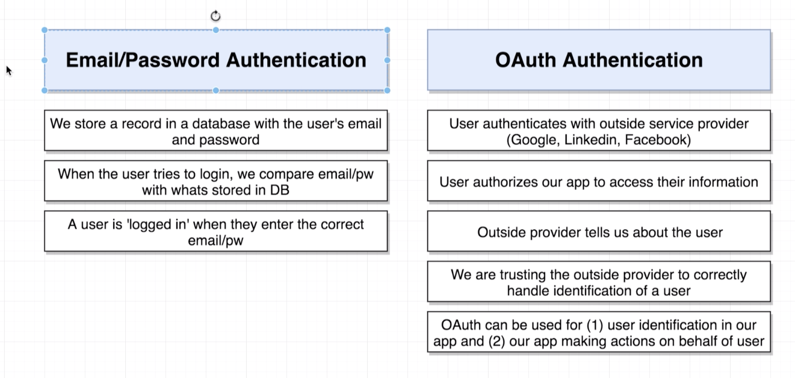

# 20200821 Handling Authentication with React

with email and password authentication, you essentially inside of your own application are maintaining a record of who each user is. And you have some very intricate and detailed information about each and every user. Anytime that a user tries to log in with email and password authentication, we're essentially going to take and compare the entered e-mail and password with whatever is saved inside the database. And then a user is considered to be logged in to an application whenever they enter the correct email and password.

with oauth authentication, a user is going to first authenticate with some outside service provider through email and password authentication means. And an outside service provider is any oauth provider such as Google or LinkedIn or Facebook. with this flow, we are essentially getting a user to authorize our application to access their information stored on Google's or LinkedIn or Facebook servers. So this outside provider is going to essentially tell us some information about this user such as their email name or whatever other info we request. So we are really trusting this outside provider to identify this user, and we are absolutely trusting this outside provider that they are telling us correct information here.

So with email and pass authentication, that is like you collecting credentials on your own, like some identification for the user. Whereas with oauth authentication, we are essentially trusting some friend of that person saying that they are who they say they are.

with email and password authentication, this is solely about authentication. It is just about identifying a user and associating some information with them. But with oauth, we actually get kind of two results out of this flow. On the one hand, we still get that same type of user identification inside of application.

So when the user goes through a oauth flow, we get some information that says oh yeah this is Jane Doe and this is their email address and here is their picture or whatever it is. But with the oauth flow, we also can request access to make actions on behalf of the user through that service provider.

if we put together some application that wanted to manage a user's e-mail account, like filter their emails or try to read their emails. We would use a oauth flow to get access to that user's e-mail account.

So oauth is not only about authentication, it's also about letting our application get access to all that user's data on some outside service provider.

---

how do you actually use this oauth flow to make actions or requests over to Google on behalf of a user.

every time that you go through oauth flow, its eventually is going to say something like Hey this app wants to know your e-mail, access your profile, maybe it will also say read your browser history or access all of your e-mails or whatever else that might be.

The list of things that the app wants to do is known as its list of scopes. A scope is essentially a permission that you are granting to an application. Now with Google in particular you can get a list of all valid scopes at this address right here.

---

this scope is intended to be a string like a string value that we are going to pass over to Google when we go through the oauth flow. The scope even though it looks like a url is not something that you're going to add into your address bar.

Oauth for JS browser Apps is going to be a flow specifically made for enabling authentication of users who are making use of a javascript application running inside of a browser.

Both of these different flows or both of these different approaches to handling oauth with the user is going to effectively kind of have the same result. at the end of the day, we are asking the user to provide us access to information about them through some outside service provider. And as a result to this process, we're going to get some identifying information for the user such as a profile or an e-mail address or an identification number. And we're also going to get a token that is going to allow us to take some action on behalf of a user without them directly involved or being involved. So that's true of both these different flows.

usually we are going to be making use of the Oauth for servers flow anytime that you are building an application that needs to access user data when they are not actively logged into application or actively making use of it. if you are building some application that is going to attempt to access the user's e-mail every 10 minutes, and maybe attempt to delete some e-mails that are flagged to spam or something like that. but that type of application you would want to be able to access their e-mail account every 10 minutes regardless of whether or not the user is actively logged into your application and making use of it. So for that type of application you would want to use this Oauth for servers flow.

We are only making use of Google Oauth just to allow a user to log in and then attempt to create a stream. So we're not really associating a lot of information with the streams that are being created from each of these users. And we also don't have any need to attempt to access that user's data on Google servers. So we're going to instead use this other flow over here because we are only trying to kind of deal with this user when they are actively logged into our application and making use of it.

we're going to make use of a javascript library created by Google themselves to automate this entire authentication process.

So the entire flow for Oauth is going to be some interaction between our user and Google servers.

everything is going to begin when the user clicks on the log in with Google button inside of our header. When that occurs, we are going to hook up a click event handler to that button. And so whenever user clicks on it, we are going to run some code that is going to call Google's javascript library and initiate the Oauth process.

When we do that call to that javascript library, then that javascript library is going to automatically make an authentication request over to Google. The result of which is going to be a little pop up window that appears inside of the user's browser. So this is going to be like a separate window that appears and prompts the user. the user is going to be prompted to grant access to our application to access their user account and get some information about them. So the user is going to click some accept button, and then when that occurs, that pop up window is going to automatically close. when the user accepts and that window closes, the javascript library running inside of our application is going to invoke a callback essentially inside of our react and redux application. This callback is going to be invoked with some authorization token and profile information about this user. And that's what's going to identify this user and essentially prove that they are successfully logged in through Google. At that point in time we will then consider the user to be logged in as well.

if the user ever happens to log out of our application or happens to log out of Google servers, we are going to get another callback invoked, and this other callback is going to essentially say hey the user just logged out. So we'll need to make sure that we also wire up our application to listen for that callback event as well.
