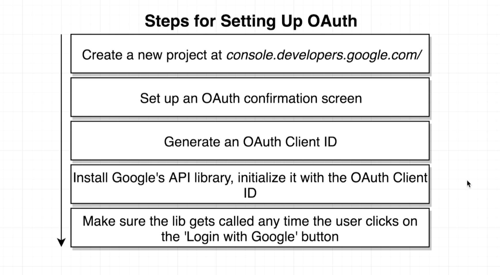

# 20200901 Handling Authentication with React



We're then going to generate an Oauth client ID. This is going to be an identifying token that is going to identify our application to Google servers. following that we'll then install Google's API library, and initialize it with that oauth client id, and then we'll make sure that any time that the user clicks on that log in with Google button, we make use of that Google API library to start the oauth process.


Now the only thing we have to add in here is a authorized javascript origin. This little check right here or whatever url right here is essentially a little security check. Google is only going to allow Oauth requests to come in from a domain that is equal to whatever we list right here. So at present, we are making use of our react application at local host 3000. So the only thing that we care about is the client id. We are not going to be making use of our client secret. We would only make use of that client secret if we were creating a flow with the Oauth for servers flow. But we are doing Oauth for JS browser applications and for that type of flow, we only need the client id.

```js
<script src="https://apis.google.com/js/api.js"></script>
```

So now the next thing we're going to do is install the Google API library into our project. Google themselves do not offer this library over NPM. So we're not going to install it via NPM. Instead we're just going to add a manual script tag into our index.html file. I'll then find the head tag. And anywhere inside of the head tag I'm going to add in a script tag.


this object right here is the Google API that is available to us on the windows scope inside of our browser. So we're now going to create a new react component that's going to essentially wrap this Google Library and Usher our user through the entire oauth process.

We're going to hook up this new component inside of our header component.

---


how this Google API library works.

You see this gapi thing right here is a multipurpose Google API library. And we can use it to interact with the Oauth flow, but we can also use it to work with all different types of Google services. So any time that we want to use some particular aspect of functionality in this library, we have to first literally load up the javascript code related to the part of the library that we want to use. when you print out gapi right now you'll see that it only has a single function tied to it called load. load literally means load up some internal library by making a follow up request over to Google servers and fetching some additional amount of javascript code. and then adding it essentially to this Google library. So to do so we're going to call:

```js
gapi.load("client:auth2");
```


we can then run that line of code, and we'll see this additional request automatically made to fetch some additional javascript code and load it up into that library. Then let's just print out gapi by itself, and you'll very quickly see that it has some additional properties inside that object. in addition to that load function, we also have a couple of other functions inside of here as well.

So after we load up that additional library, we can then register or initialize it with our Oauth client id by calling:

```js
gapi.client.init({ clientId: "clientid" });
```

we probably only want to initialize that library or kind of like load up the client portion of the library one time when this component is first rendered onto the screen. So with that in mind I'm going to define a componentDidMouth lifecycle method inside of the Google Oauth component.
