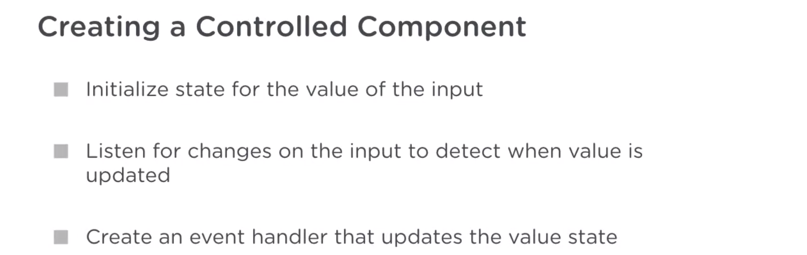

# React Basics

```html
<!-- CDN links -->
<body>
  <script
    crossorigin
    src="https://unpkg.com/react@16/umd/react.development.js"
  ></script>
  <script
    crossorigin
    src="https://unpkg.com/react-dom@16/umd/react-dom.development.js"
  ></script>
  <script src="./app.js"></script>
</body>
```

```js
const title = React.createElement(
  "h1",
  { id: "main-title", title: "This is an title." },
  "my first React element title"
);

const desc = React.createElement("p", null, "my first React element");
```

React does not create actual DOM nodes(actual h1, div, span). For instance, the title element we defined is not a real h1 element. It's actually an object that describes a DOM node. It's an object representation of a DOM node.

The elements that React creates are actually plain JavaScript objects that describe the element you'd like to display to your UI.

```js
ReactDOM.render(title, document.getElementById("root"));
```

This is the function that actually does the creating and updating of the DOM. It's what connects React to the DOM.

The React code we write in app.js will be rendered into this root div. Or in React terms, this is where we will be mounting our React application. Any existing DOM elements inside the root div will be replaced when render is first called. So everything inside the root DOM element gets managed by ReactDOM.render.

You can provide the children as any number of arguments after the props argument. createElement considers anything after the second argument as children.

React never touches the actual DOM directly. It just manages what gets rendered to the DOM and what gets updated via reactDOM.render. It's not until render that the browser creates actual DOM elements like our header and its children. So in other words, it's renders job to interpret the element objects and create DOM nodes out of them.

React only manages what gets rendered to the DOM via ReactDOM.render. It's the job of render() to interpret the element objects and create DOM nodes out of them.

babel-standalone

```html
<script src="https://unpkg.com/babel-standalone@6/babel.min.js"></script>
```

JSX is an extension to the JavaScript language that uses a markup-like syntax to create React elements.

Now JSX still produces objects that describe a DOM node.

Since JSX is an extension to the JS language, it accepts any valid JavaScript expressions written inside curly braces.

```js
const title = "my first React element";
const desc = "Hi";
const name = "main-title";

const header = (
  <header>
    {/*this is comment*/}
    <h1 className={name}>{title}</h1>
    <p>{desc}</p>
  </header>
);
```

When you use curly braces in JSX, it's called a JSX expression.

---

A component is a piece of UI that you can reuse. Just like you're able to reuse code in JavaScript with functions, a component lets you reuse code that renders a part of your UI. Being able to split your UI code into independent, reusable pieces, and think about each piece in isolation is one the most embraced features of React.

React components are required to begin with an upper case letter.

JSX lets you define your own tags. A JSX tag can not only represent an HTML element (like \<h1>,\<span>, and \<header>), it can also represent a user-defined component.

The capital letter in the tag name is necessary to differentiate custom components from native DOM elements. Second, is that you can use the self closing form of the tag, if the component has no children. Finally, a component's JSX tag is also a function called to React.createElement under the hood.

When a component contains another component, it's called composition. Composing components is a core principle in React. You'll usually have parent components with one or many child components. This gives the parent component the ability to control how its child components are rendered.

ReactDOM.render usually renders your top level element into the DOM.

---

Every React component and element can receive a list of attributes called properties (or props). Props are a core concept in React because it's how you get data into a component. Most of the components in your UI will be configured with props. For example, you'll add functionality to a component, have it behave a certain way, and display its contents with props.

Anytime you pass a prop a value other than a string, like a number or a variable, you should place it between curly braces so that is gets evaluated as a JSX expression.

When you define a component using a function, the function gets one default argument from React, a props object containing a list of props given to the component.

An important detail to remember about props is that they are "read only" (or immutable), which means that a component can only read the props given to it, never change them. The (parent) component higher in the tree owns and controls the property values.

As stated in the React docs:

All React components must act like pure functions with respect to their props.

That way you avoid unintended behavior (or side effects) in your components. Further, React components are similar to "pure" functions in JavaScript. They do not attempt to change their inputs, and always return the same result for the same inputs.

React manages what gets rendered to the DOM. In order for this process to be fast and efficient, React needs a way to quickly know which items were changed, added, or removed. For this, React gives elements a special built-in prop named key. A key is a unique identifier that gives React a way to quickly and reliably identify an element in a list.

And not all React elements need a key prop. Pass a key prop anytime you're creating elements by iterating over an array of items that will be rearranged, added or deleted in your UI. The key will help React identify which items were changed, added or removed from the DOM.

---

In React, "state" is the data you want to track in your app. State is what allows you to create components that are dynamic and interactive, and it's the only data that changes over time.

State itself is a regular JavaScript object with properties that define the pieces of data that change.

Class components offer a more powerful way to build components because they're the only type of components that let you use state.

In JavaScript classes, the extends keyword is used to create a subclass,
or a child of another class. In this case, we're extending from React.Component which is part of React's API for component class definition.

The only method you need to define in a class component is called render.

In class components, props are not accessed through arguments like they are in functional components. Props are a property of the component itself. So "this" refers to the component instance.

So when do you use a class versus a function?

If a component is only receiving input through props and rendering UI, it's best to use a function or a stateless functional component. Functions are a little bit easier to write, read and understand, and you can think of a stateless functional component as just the render method from a class component with props passed in as an argument.

Now when you want to add state, that's when you use a class component. However, you can also create stateless components as classes.

```js
class Counter extends React.Component {
  constructor() {
    super();
    this.state = {
      score: 0
    };
  }
  render() {
    return (
      <div className="counter">
        <button className="counter-action decrement"> - </button>
        <span className="counter-score">{this.state.score}</span>
      </div>
    );
  }
}
```

Inside the constructor, I'll call super in order to call the constructor of the component class that we're extending. And this needs to be done before we can use the this keyword within the constructor.

You can think of the render method in a class component as being a function of not just props, but props and state. In other words, if either props or state changes, React executes the render method to update what gets displayed to the user.

```js
class Counter extends React.Component {
  state = {
    score: 0
  };
  render() {
    return (
      <div className="counter">
        <button className="counter-action decrement"> - </button>
        <span className="counter-score">{this.state.score}</span>
      </div>
    );
  }
}
```

This class properties syntax is a feature of JavaScript that's currently not supported in all browsers. Since we're using the Babel transpiler in our app, we don't have to worry about browser's support. Babel will transpile our code and add a constructor for us behind the scenes.

To make the Counter component interactive, we need to be able to trigger changes to the data in state. We'll first create an event handler that updates state, using React's built-in setState() method. Then we'll give the buttons an onClick event that calls the event handler when clicked.

In objects or classes, "this" usually refers to the parent that owns the method(This should be the counter class).

When you create a class component that extends from React.Component, any custom methods you create are not bound to the component by default. You need to bind your custom methods, so that this refers to the component instance.

arrow functions use what's called a lexical this binding which means that it automatically bind them to the scope in which they are defined.

We know that inside the render method, this refers to the counter component instance. The arrow function is enclosed inside the render method, so it takes on that same context. And the this value inside it will properly point to the counter component instance.

```js
incrementScore() {
    this.setState({
      score: this.state.score + 1
    });
  }
<button onClick={this.incrementScore.bind(this)}> + </button>

---
incrementScore() {
    this.setState({
      score: this.state.score + 1
    });
  }
<button onClick={() => this.incrementScore()}> + </button>

---
incrementScore = () => {
    this.setState({
      score: this.state.score + 1
    });
  }
<button onClick={this.incrementScore}> + </button>
```

Another way to bind an event handler is in the class constructor:

```js
constructor() {
  super();
  this.state = { score: 0 };
  this.incrementScore = this.incrementScore.bind(this);
}
```

Then pass the function to a React event like so:

```js
<button onClick={this.incrementScore}> + </button>
```

Whenever you need to update state based on previous state, you shouldn't rely on this.state to calculate the next state. State updates may be asynchronous, so it may not always lead to the component re-rendering with new data, and could cause state inconsistency. setState() accepts a callback function that produces state based on the previous state in a more reliable way.

```js
incrementScore = () => {
  this.setState(prevState => ({
    score: prevState.score + 1
  }));
};
decrementScore = () => {
  this.setState(prevState => {
    return {
      score: prevState.score - 1
    };
  });
};
```

One important concept to understand is the different types of state. There are two main types of state I consider when designing a React app, application state and component state.

Application state is the main state we typically think about. It's usually the data that's available to the entire app. In our scoreboard app, application state lives in the app component, and all of its child components have access to it.

The counter however has state that's not shared or visible outside of the component. It's state required just for that component to do it's job like increasing and decreasing the score. This type of state is refered to as local component state.

---

Why Create React App?

In React Basics, you started to build the scoreboard app using the CDN links to help you focus on learning React, without having to worry about installing and running any tools.

The CDN-based approach is not useful in a production environment as soon as you start using JSX. For instance, we used Babel directly in the browser to transpile JSX into JavaScript. The Babel script is ~800KB in size, which for most use cases, is too large of a download to be practical. Also, there's the overhead in the browser of transpiling JSX into JavaScript.

Developers use compiling as part of a build process to avoid the overhead of downloading Babel and multiple JavaScript files to the client. Create React App sets up a modern build system for your React apps in little time, no need to install or configure tools like Webpack or Babel. The tools are already pre-configured in each new project, that way you can focus on building your app.

```cmd
npx create-react-app scoreboard
cd scoreboard
npm start
```

What's in package.json?

When you create a project with Create React App, it installs the latest version of React and React-DOM, as well as the latest version of react-scripts, a development dependency that manages all other dev dependencies that run, test and build your app.

Another way to export a class

```js
export default class Counter extends Component {
  render() { ... }
}
```

Another way to export a function

```js
export const Counter = () => {
  return ( ... );
}
```

Then import the function:

```js
import { Counter } from "./Counter";
```

```npm
npm install --save prop-types
```

---

Data always flows downward in a React app. This means an ancestor state can be passed down to it's descendants through props. But descendants can't past data back up. Sometimes data needs to travel back to an ancestor though. for example a form field is a common example of a decadent that need to report it's content up to the larger app. To do that an ancestor must define a call back function and pass it down to the decadent. The function can accept data, like the text from an input and add it to the ancestor state. That function can then be bound to events on that child component, sending data back to the ancestor every time the event occurs. So, for example, when a text input element's on change event occurs, meaning the user is typing into the field an ancestor's call back bound to that event will fire passing the text up to the ancestor.

Functions retain access to the scope in which they were defined. This is known as a closure.

To get data from a child component to a parent, You need to define a callback in the parent and pass it down to the child, and bind it to one of the child's events.

```js
<Widget>{props.data}</Widget>
```

props.data can be accessed from within the Widget component by props.children

---

Since data in React flows downward, a child component has no way to directly communicate to its parent. But React allows us to use props that are callback functions to communicate data
upstream, from a child to a parent. For example, we can write event handlers that manipulate state, and pass them down to component as callback functions. When a child wants to indicate that the application state should change, like click a button to change the score, it will execute the callback function and the parent will know what to do to update the data.



To manage an input field's state, we need to build a "controlled component." A controlled component renders a form element whose values are controlled by React, with state.

If we don't prevent the form's default submit behavior, it will result in the browser posting a request back to the server. That would cause our application to reload in the browser, which means that we'd lose all of our application state in the process.

Component Lifecycle:

We can use one of React's built in lifecycle method. In React, every component instance follows a cycle. It's mounted onto the DOM, it's updated with changes in data, and finally, it's unmounted from the DOM.

React Lifecycle Methods:

React's built-in lifecycle methods get called at each point in a component's life-cycle. The methods act as hooks you can use to run code at key times in the life-cycle. This gives you the ability to control what happens when a component mounts, updates and unmounts.

Prevent Memory Leaks with componentWillUnmount():

Since components do not always stay in the DOM, React also provides the componentWillUnmount lifecycle method to help you handle unmounting of components. This can help prevent memory leaks in your application.

Optimize Performance with PureComponent:

React provides a special type of component, called PureComponent, that helps prevent unnecessary re-renders. If your component’s render() method renders the same result given the same props and state, you can use PureComponent for a performance boost in some cases. A PureComponent should only contain child components that are also PureComponents.

PureComponent implements a lifecycle method behind the scenes called shouldComponentUpdate that runs a shallow comparison of props and state. The lifecycle method automatically checks whether a rerender is required for the component and calls render only if it detects changes in state or props.

Destructuring Props:

ES2015 introduced destructuring assignment, which is a special kind of syntax you can use to "unpack" (or extract) values from arrays, or properties from objects, into distinct variables. Developers often use destructuring in React to make their components cleaner and easier to understand. It provides a more concise way to write your props.

Refs and the DOM:

Refs let you access and interact with DOM nodes created in the render() method. They make it possible to do the more traditional DOM manipulation, and they're commonly used to access form elements and get their values.

when building forms, when should you use a controlled component instead of creating refs, and vice versa?

Well, controled components have internal state and require functions to update state. They make it easier to modify or validate user input or filter results based on user input in real time. Control components with state call render on every keystroke, where as in refs, render is only called once. So whenever you're building a form that requires field inputs and you don't need to keep track of every keystroke, you have the option to create an uncontrolled component, and use refs to get the form values from the DOM.

Validate Props with PropTypes:

```npm
npm install --save prop-types
```

As your app grows, it's a good practice to "type check" or validate the data a component receives from props. PropTypes not only help you catch and avoid bugs, they also serve as a documentation for components. Other developers working on the same project will know exactly which props your components take, and what types they should be.

Type checking in React: PropTypes, TypeScript, Flow

In class components, it's common to define propTypes inside the class with the static keyword. You can also set a default value for your props, with a defaultProps object.
